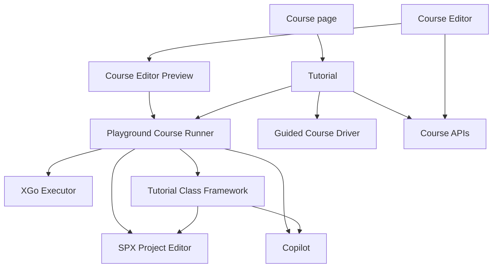

# Tech design for [Playground Courses](https://github.com/goplus/builder/issues/3403)

## Scope

XBuilder keeps two independent Course models:

- A **Guided Course** is driven by Copilot and may guide the learner across Builder routes.
- A **Playground Course** embeds an SPX project and an XGo Tutorial program. The learner edits a session-local project model while the Tutorial program controls the course flow and completion.

This design introduces neither Course draft/published revisions nor persisted runtime sessions or unfinished-course progress. Course Preview runs directly from the Course Editor's unsaved in-memory state. Course package import/export and linting remain internal Course Editor concerns for now.

## Modules

### Course APIs

Course APIs own the persistent Course and Course Series contracts. A Course is a discriminated union of `guided` and `playground`; a Course Series contains exactly one Course kind.

The TypeScript module describes the frontend/backend HTTP contract. Database tables, constraints and migration are documented separately because they are backend implementation details that are not visible in that interface.

See [Course APIs](./module_CourseApis.ts) and [Course storage](./course-storage.md).

### Tutorial

Tutorial owns course lifecycle and dispatches each Course to a Guided Course Driver or Playground Course Driver. It owns course dialogs and completion UI, but it does not implement the project editor, Copilot or XGo execution.

For a Playground Course, the driver creates a model `SpxProject` without cloud-project identity, builds an `EditorState`, mounts the SPX Project Editor and starts a Copilot Topic. It then binds the Tutorial Class Framework to those frontend capabilities and asks the XGo Executor to import that framework package while running the Tutorial program. Stopping or completing the Course tears these resources down together.

See [Tutorial](./module_Tutorial.ts).

### XGo Executor

XGo Executor builds and executes an XGo program in an isolated Worker/WASM instance. XGo-to-JavaScript calls use asynchronous capabilities; JavaScript-to-XGo notifications use events. `stop` terminates the Worker and is the lifecycle boundary for a running program.

The executor is generic: it knows source files, imported packages, capabilities and events, but has no Course, Tutorial Class Framework, Editor or Copilot concepts. Playground Course Runner supplies the Tutorial Class Framework as one imported package.

See [XGo Executor](./module_XGoExecutor.ts).

### Tutorial Class Framework

The Tutorial Class Framework defines the Course-author-facing XGo API and binds it to frontend capabilities. Its Course-author-facing Go contract is included in this design:

```text
course
├── CourseAbilities
├── editor
│   ├── project
│   ├── runtime
│   └── codeEditor
├── copilot
└── spotlight
```

The initial interface includes course start/message/video/completion, runtime start/exit/log, API filtering, workspace formatting, Copilot round completion and spotlight reveal. `editor.project` is reserved until concrete project capabilities are required.

See [Tutorial Class Framework](./module_TutorialFramework.ts) and its [Go contract](./tutorial-class-framework.go).

### SPX Project Editor

SPX Project Editor comprises the existing `ProjectEditor`, `EditorContextProvider`, `EditorState`, Runtime, Code Editor and Stage Viewer. It receives an already constructed model `SpxProject` and `EditorState`; loading remains the caller's responsibility.

Course projects omit owner and cloud-project identity, so the existing ownership rule naturally selects effect-free editing. Course learning does not call the normal route's `editing.loadProject`, avoiding cloud and local-cache loading.

Simple Mode is exposed as a reusable `SimpleProjectEditor` component within this module. `ProjectEditor` and `SimpleProjectEditor` are sibling compositions: both reuse the module's Code Editor, Stage Viewer and runtime controls, while `SimpleProjectEditor` arranges only the parts needed by Simple Mode and locks editing to one sprite. Stage Viewer sprite-name clicks insert the name at the current Code Editor cursor. Callers explicitly choose either editor component.

See [SPX Project Editor](./module_SpxProjectEditor.ts).

### Copilot

Copilot supplies generic sessions, Topics, response generation, round events and Topic-level behavior controls. It has no Course or Tutorial concepts.

The Playground Driver puts private Course context in the existing Topic description and disables proactive event reactions. Project, code and runtime context continue to come from normal Editor context providers. The Topic's `allowCodeHelper: false` hides both code-block Copy and code-change Apply for that session.

See [Copilot](./module_Copilot.ts).

### Course Editor

Course Editor edits Course metadata, the embedded model project, Tutorial program, local files, Copilot context and editor kind. It owns the Tutorial Language Server integration needed for program diagnostics, completion and hover; that Language Server is not designed separately here.

Preview snapshots the current in-memory project and other unsaved fields, then invokes the real Playground Course runner. It never saves first and never passes the author's mutable project instance into the preview.

Package import/export and Course linting are internal features of this module and are outside the current interface design.

See [Course Editor](./module_CourseEditor.ts).

## Module relationships



## Key feature implementations

### Playground Course runtime

Shows how one Playground Course wires the SPX Project Editor, Copilot, Tutorial framework and XGo Executor, including idempotent completion and joint cleanup.

See [Playground Course](./feature_PlaygroundCourse.ts).

### Course Preview

Shows how Preview clones the Course Editor's unsaved in-memory state and invokes the same Playground Course runner used for learning.

See [Course Preview](./feature_CoursePreview.ts).

### Simple Project Editor

Shows how `SimpleProjectEditor` composes shared SPX Project Editor building blocks and inserts a clicked sprite name at the current code cursor.

See [Simple Project Editor](./feature_SimpleProjectEditor.ts).
