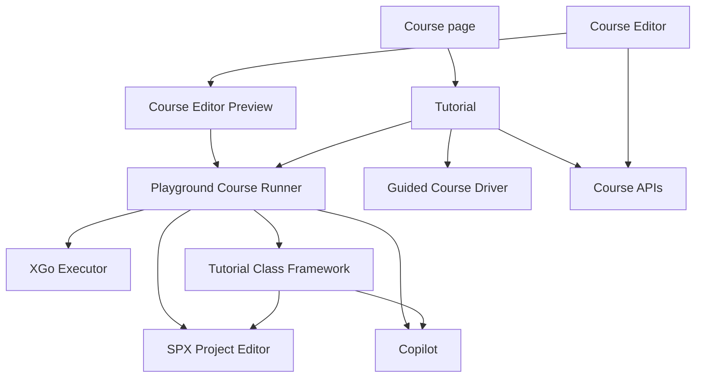

# Tech design for [Playground Courses](https://github.com/goplus/builder/issues/3403)

## Scope

XBuilder keeps two independent Course models:

- A **Guided Course** is driven by Copilot and may guide the learner across Builder routes.
- A **Playground Course** embeds an SPX project and an XGo Tutorial program. The learner edits a session-local project model while the Tutorial program controls the course flow and completion.

This design introduces neither Course draft/published revisions nor persisted runtime sessions or unfinished-course progress. Saving a Course makes it available for learning. Course Preview runs directly from the Course Editor's unsaved in-memory state. Course package import/export and linting remain internal Course Editor concerns for now.

## Modules

### Course APIs

Course APIs own the persistent Course and Course Series contracts. A Course is a discriminated union of `guided` and `playground`; a Course Series contains exactly one Course kind. Playground Course content crosses this boundary as an opaque `FileCollection`. Course APIs also provide LLM-assisted generation of an editable Copilot context from the author's current in-memory file collection.

The TypeScript module describes the frontend/backend HTTP contract. Course storage uses one table with common columns and opaque `content jsonb`; the database does not depend on the versioned internal format of a Tutorial project. Database constraints and migration are documented separately because they are backend implementation details that are not visible in that interface.

See [Course APIs](./module_CourseApis.ts) and [Course storage](./course-storage.md).

### Tutorial

Tutorial owns course lifecycle and dispatches each Course to a Guided Course Driver or Playground Course Driver. It owns course dialogs and completion UI, but it does not implement the project editor, Copilot or XGo execution.

For a Playground Course, the driver creates a model `SpxProject` without cloud-project identity, builds an `EditorState`, mounts the SPX Project Editor and starts a Copilot Topic. It then binds the Tutorial Class Framework to those frontend capabilities and asks the XGo Executor to import that framework package while running the Tutorial program. Stopping or completing the Course tears these resources down together.

See [Tutorial](./module_Tutorial.ts).

### XGo Executor

XGo Executor builds and executes an XGo program in an isolated Worker/WASM instance. XGo-to-JavaScript calls use asynchronous capabilities; JavaScript-to-XGo notifications use events. `stop` terminates the Worker and is the lifecycle boundary for a running program.

The executor is generic: it knows source files, imported packages, capabilities and events, but has no Course, Tutorial Class Framework, Editor or Copilot concepts. Playground Course Runner supplies the Tutorial Class Framework as one imported package.

See [XGo Executor](./module_XGoExecutor.ts).

### Tutorial Class Framework

The Tutorial Class Framework defines both the Tutorial-project format and the Course-author-facing XGo API. The format contract owns the content directory layout and configuration schemas, including the root `index.json` that identifies the SPX project, Tutorial entry, Copilot context and initial editor configuration. Course APIs and storage do not depend on these internal details.

Its Course-author-facing Go contract is included in this design:

```text
course
├── CourseAbilities
├── editor
│   ├── project
│   ├── runtime
│   └── codeEditor
├── copilot
└── spotlight
```

The initial interface includes course start/message/video/completion with optional feedback, runtime start/exit/log, code reading, API filtering, workspace formatting, Ruler control, Copilot round completion and response generation, and spotlight reveal. `editor.project` is reserved until concrete project capabilities are required.

See [Tutorial Class Framework](./module_TutorialFramework.ts), its [Go contract](./tutorial-class-framework.go) and an [example Tutorial Course project](./example-tutorial-course/).

### SPX Project Editor

SPX Project Editor comprises the existing `ProjectEditor`, `EditorContextProvider`, `EditorState`, Runtime, Code Editor and Stage Viewer. It receives an already constructed model `SpxProject` and `EditorState`; loading remains the caller's responsibility.

Course projects omit owner and cloud-project identity, so the existing ownership rule naturally selects effect-free editing. Course learning does not call the normal route's `editing.loadProject`, avoiding cloud and local-cache loading. Project Editor nevertheless offers `saveAsProject`, which creates an owned regular Project from the learner's current session-local state through its existing project persistence dependencies.

The Course data selects the initial editor experience and, for Simple Mode, the target sprite. This is the sole declarative presentation configuration: runtime tools such as API filtering and the Ruler remain controlled by the Tutorial program.

Simple Mode is exposed as a reusable `SimpleProjectEditor` component within this module. `ProjectEditor` and `SimpleProjectEditor` are sibling compositions: both reuse the module's Code Editor, Stage Viewer and runtime controls, while `SimpleProjectEditor` arranges only the parts needed by Simple Mode and locks editing to one sprite. Stage Viewer sprite-name clicks insert the name at the current Code Editor cursor. The Ruler belongs to Stage Viewer as a mode-independent stage overlay. Callers explicitly choose either editor component.

See [SPX Project Editor](./module_SpxProjectEditor.ts).

### Copilot

Copilot supplies generic sessions, Topics, response generation, round events and Topic-level behavior controls. It has no Course or Tutorial concepts.

The Playground Driver puts private Course context in the existing Topic description and disables proactive event reactions. Project, code and runtime context continue to come from normal Editor context providers. The Topic's `allowCodeHelper: false` hides both code-block Copy and code-change Apply for that session.

See [Copilot](./module_Copilot.ts).

### Course Editor

Course Editor edits Course metadata and a typed, in-memory view of the Tutorial-project file collection. It loads and writes the Tutorial Class Framework's project format; keeping these models valid is the Course Editor's responsibility rather than the Course APIs' or database's. It owns the Tutorial Language Server integration needed for program diagnostics, completion and hover; that Language Server is not designed separately here.

Preview snapshots the current in-memory project and other unsaved fields, then invokes the real Playground Course runner. It never saves first and never passes the author's mutable project instance into the preview. Course Series Preview clones every Course in the author's current in-memory series and uses the real series flow to walk them in order.

The Course Editor calls Course APIs to generate or rewrite the private Copilot context, then lets the author review and edit the result before saving. Package import/export and Course linting remain internal features of this module and require no external module interface.

See [Course Editor](./module_CourseEditor.ts).

## Module relationships



## Key feature implementations

### Playground Course runtime

Shows how one Playground Course wires the SPX Project Editor, Copilot, Tutorial framework and XGo Executor, including idempotent completion and joint cleanup.

See [Playground Course](./feature_PlaygroundCourse.ts).

### Course Preview

Shows how Preview clones the Course Editor's unsaved in-memory state and invokes the same Playground Course runner used for learning. Series Preview performs the same operation for each Course and walks the real series flow.

See [Course Preview](./feature_CoursePreview.ts) and [Course Series Preview](./feature_CourseSeriesPreview.ts).

### Simple Project Editor

Shows how `SimpleProjectEditor` composes shared SPX Project Editor building blocks and inserts a clicked sprite name at the current code cursor.

See [Simple Project Editor](./feature_SimpleProjectEditor.ts).
